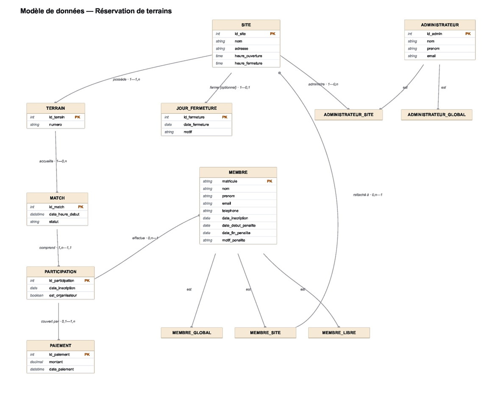

# Analyse-MCD.md

#### 1. Contexte (2-3 lignes)

Le présent projet consiste à développer une application de gestion de réservations de terrains de padel pour une organisation possédant plusieurs sites. Chaque site dispose de ses propres terrains, horaires d'ouverture et jours de fermeture, tandis que les membres peuvent réserver et participer à des matchs selon des règles spécifiques liées à leur catégorie.
L'objectif du système est de gérer les réservations, les participations aux matchs, les paiements, les membres et les administrateurs, tout en offrant une vue centralisée des activités et statistiques pour les gestionnaires des différents sites.

#### 2. Le schéma MCD

#### 3. Liste des entités avec leurs attributs

Site : id, nom, adresse, heure_ouverture, heure_fermeture
Terrain : id, numero
JourFermeture : id, date, motif
Match : id, date_heure_debut, statut
Membre (+ sous-types Global/Site/Libre) : matricule, nom, prenom, email, telephone, date_inscription, date_debut_penalite, date_fin_penalite, motif_penalite
Participation : id, date_inscription, est_organisateur
Paiement : id, montant, date_paiement
Administrateur (+ sous-types Global/Site) : id, nom, prenom, email

#### 4. Liste des relations avec cardinalités

Site (1,n) — Terrain (1,1)
Site (0,n) — JourFermeture (0,1)
Terrain (0,n) — Match (1,1)
Membre (0,n) — Match (1,n) [via Participation]
MembreSite (1,1) — Site (0,n)
AdministrateurSite (1,1) — Site (0,n)
Participation (0,1) — Paiement (1,n)

#### 5. Contraintes en langage usuel

C'est explicitement demandé par ton cours ("l'expression des contraintes en langage usuel"). Liste chaque règle métier qu'on a identifiée, en phrases simples :
Un match privé nécessite exactement 4 participations ; s'il n'atteint pas ce nombre la veille, il devient automatiquement public
Chaque participation coûte 15€ (60€ / 4 joueurs), payable à l'avance
Un MembreGlobal peut réserver 3 semaines à l'avance sur n'importe quel site
Un MembreSite peut réserver 2 semaines à l'avance, uniquement sur son site
Un MembreLibre peut réserver 5 jours à l'avance, sur n'importe quel site
Durée fixe d'un match : 1h30, avec 15 min de battement entre deux matches sur un même terrain
Si l'organisateur d'un match privé n'atteint pas 4 joueurs, une pénalité d'1 semaine de délai supplémentaire lui est appliquée
Un paiement peut couvrir plusieurs participations (ex. la participation actuelle + un solde dû sur un match antérieur)
#### 6. Justifications de modélisation — pour préparer l'oral
C'est la partie qui te fera gagner des points en défense. Note en 2-3 phrases chaque choix qu'on a dû trancher ensemble, avec ton propre raisonnement (pas le mien — reformule avec tes mots) :

#### 6.1 Pourquoi Paiement est une entité séparée de Participation
J'ai choisi de modéliser Paiement comme une entité indépendante car l'énoncé indique qu'un solde non payé peut être reporté et ajouté à un paiement futur. Un même paiement peut donc couvrir plusieurs dettes liées à différentes participations. Cette logique dépasse le simple cadre d'une participation individuelle et justifie l'existence d'une entité métier propre.

#### 6.2 Pourquoi JourFermeture n'a pas d'attribut « type global/spécifique »
J'ai considéré qu'un attribut supplémentaire n'était pas nécessaire. Une fermeture globale est représentée par l'absence de lien avec un site, tandis qu'une fermeture locale est représentée par une association avec un site précis. La relation optionnelle entre JourFermeture et Site suffit donc à distinguer les deux cas sans introduire de redondance.

#### 6.3 Pourquoi les délais de réservation ne sont pas stockés en base
Les délais de réservation sont définis par l'énoncé et sont identiques pour tous les membres d'une même catégorie. Ils ne varient pas d'un membre à l'autre. J'ai donc considéré qu'il s'agit de règles métier à documenter dans les contraintes fonctionnelles plutôt que de données à stocker dans la base.

#### 6.4 Pourquoi Membre et Administrateur sont deux entités distinctes
L'énoncé distingue clairement les membres, qui participent aux matchs, des administrateurs, qui gèrent les sites et consultent les statistiques. Aucune information ne précise qu'un administrateur est nécessairement un membre ou qu'il possède un matricule de membre. J'ai donc choisi de modéliser ces deux concepts comme des entités indépendantes.

#### 6.5 Pourquoi il n'y a pas de relation directe entre Paiement et Membre
Le membre ayant effectué un paiement peut être retrouvé à travers les relations existantes : Paiement → Participation → Membre. Ajouter une relation directe entre Paiement et Membre reviendrait à stocker deux fois la même information et introduirait un risque d'incohérence. Comme l'énoncé ne mentionne aucun paiement indépendant d'une participation, cette relation supplémentaire ne se justifie pas.

#### 7.  Modèle Logique de Données (MLD)

## MLD — Modèle Logique de Données

SITE (id_site PK, nom, adresse, heure_ouverture, heure_fermeture)

TERRAIN (id_terrain PK, numero, id_site FK → SITE)

JOUR_FERMETURE (id_fermeture PK, date_fermeture, motif,
id_site FK → SITE, NULLABLE)

MATCH (id_match PK, date_heure_debut, statut, id_terrain FK → TERRAIN)

MEMBRE (matricule PK, nom, prenom, email, telephone,
date_inscription, date_debut_penalite, date_fin_penalite, motif_penalite,
type_membre, id_site FK → SITE, NULLABLE)

PARTICIPATION (id_participation PK, date_inscription, est_organisateur,
matricule FK → MEMBRE,
id_match FK → MATCH,
id_paiement FK → PAIEMENT, NULLABLE)

PAIEMENT (id_paiement PK, montant, date_paiement)

ADMINISTRATEUR (id_admin PK, nom, prenom, email,
type_admin, id_site FK → SITE, NULLABLE)

#### 8. Règle de placement des clés étrangères

## Règle appliquée pour le placement des FK

Pour chaque relation (1,n), la clé étrangère est placée du côté où
la cardinalité maximale est 1 (le côté "plusieurs" ne peut pas porter
la FK, sinon il faudrait une liste de valeurs dans une seule colonne).

Cas particulier : Membre ↔ Match via Participation
- Les deux cardinalités max sont "n" (many-to-many)
- → nécessite une vraie table d'association avec 2 FK : Participation
  (matricule FK → Membre, id_match FK → Match)

#### 9. Justification de la stratégie de spécialisation

## Spécialisation Membre / Administrateur — choix et justification

### Stratégie retenue : table unique avec discriminant (stratégie A)

Justification : MembreGlobal, MembreSite et MembreLibre n'ont
pratiquement aucun attribut propre (seul MembreSite a une relation
vers Site). Pareil pour AdministrateurGlobal / AdministrateurSite.
Dans ce cas précis, créer des tables séparées par sous-type (stratégie B)
ou une table mère + tables filles (stratégie C) ajouterait de la
complexité sans bénéfice réel. La table unique + colonne discriminante
(type_membre / type_admin) est la solution la plus simple et suffisante.

### Nuance : redondance matricule / type_membre

Le matricule porte déjà l'information du type via son préfixe (G/S/L),
ce qui rend la colonne type_membre techniquement redondante d'un point
de vue strictement normalisé. Elle est conservée malgré tout car :
- elle améliore la lisibilité des requêtes
- elle facilite les filtres et les index
- elle évite d'extraire systématiquement le préfixe du matricule

Cette redondance est acceptable à condition de mettre en place un
contrôle de cohérence entre le matricule et le type stocké (ex.
contrainte CHECK ou validation applicative garantissant que
matricule commence par 'G' ⟺ type_membre = 'GLOBAL', etc.)

### Attributs écartés (non ajoutés car non justifiés par l'énoncé)

- Pas de "matricule admin" avec préfixe : rien dans l'énoncé ne décrit
  un tel système pour les administrateurs (contrairement aux membres)
  → id_admin (int auto-incrémenté) suffit
- Pas de telephone pour Administrateur : non demandé par l'énoncé

## Choix techniques liés à l'implémentation JPA (découverts en semaine 2)

- Sensibilité à la casse Hibernate/SQL Server : Hibernate valide par défaut
  les noms de table en minuscules, ce qui provoquait une erreur malgré
  l'existence réelle des tables (créées en majuscules par Flyway).
  Résolu via spring.jpa.properties.hibernate.globally_quoted_identifiers=true.

- Statuts représentés par des enums Java (Match.Statut, Membre.TypeMembre,
  Administrateur.TypeAdmin) plutôt que par de simples chaînes de caractères,
  pour garantir à la compilation que seules les valeurs autorisées sont
  utilisées — renforce la contrainte CHECK déjà présente au niveau SQL.

- Montant des paiements en BigDecimal (pas double/float), pour éviter les
  erreurs d'arrondi en virgule flottante sur des valeurs monétaires.

## Choix techniques liés à l'authentification (27/07/2026)

- Authentification stateless par JWT (pas de session serveur) : cohérent
  avec une API REST, chaque requête porte son propre token.
- Le JWT contient le matricule (sujet) et le type de membre (claim custom)
  — évite une requête base de données supplémentaire pour connaître le rôle
  à chaque contrôle d'accès.
- CSRF désactivé : protection pensée pour les sessions par cookies, non
  pertinente pour une API stateless authentifiée par token.
- Spring Security génère par défaut un utilisateur/mot de passe temporaire
  au démarrage s'il ne trouve pas de UserDetailsService — on fournit donc
  notre propre UserDetailsService (qui lève systématiquement une exception,
  puisqu'on ne l'utilise jamais réellement) pour neutraliser ce comportement,
  plutôt que d'exclure l'autoconfiguration par son nom de classe complet
  (le chemin du package Spring Boot 4.0 pour cette classe s'est révélé
  instable/mal documenté).

## Architecture backend (27/07/2026)

Architecture en couches strictement respectée sur l'ensemble du projet :
Controller → Service → Repository

Chaque controller REST délègue systématiquement à un service dédié,
même pour du CRUD simple (ex. TerrainController), afin de garder une
architecture homogène et de faciliter l'ajout futur de logique métier
sans avoir à refactorer les controllers.

## Architecture frontend (28/07/2026)

CORS configuré côté backend (SecurityConfig) pour autoriser uniquement
http://localhost:4200 en développement.

Authentification stateless côté frontend : le token JWT n'est jamais
persisté (ni localStorage, ni cookie) — stocké uniquement en mémoire
dans le service Auth. Conséquence assumée : la session se perd au
rafraîchissement de page (F5), acceptable pour la portée du projet.

Guard fonctionnel (CanActivateFn, syntaxe Angular moderne) plutôt que
guard par classe — plus concis, recommandé par la doc Angular actuelle.

Interceptor HTTP fonctionnel (HttpInterceptorFn) qui clone chaque
requête sortante pour y ajouter le header Authorization — les objets
HttpRequest étant immuables en Angular, le clonage est la méthode
standard (pas une mutation directe).

## Extension de l'authentification aux administrateurs (08/08/2026)

L'énoncé ne prévoit pas de matricule pour les administrateurs (contrairement
aux membres). Pour permettre leur connexion tout en respectant ce choix de
modélisation initial, un identifiant de connexion synthétique est généré
côté backend (format ADMIN-{id_admin}), distinct du concept de matricule
propre aux membres. Ce choix pragmatique est documenté ici pour être
justifiable à l'oral : il ne modifie pas le schéma de données validé,
juste la couche d'authentification applicative.

## Vérification des rôles (correction, 08/08/2026)

Suite à une relecture des exigences, la vérification des rôles a été
ajoutée sur les endpoints d'administration (sites, terrains, membres,
administrateurs) — initialement seule l'authentification était vérifiée,
pas le rôle spécifique. Corrigé pour respecter l'exigence : "différents
rôles utilisateurs permettent de réaliser des opérations spécifiques à
ces rôles."

## Justification des extensions de fonctionnalités (09/08/2026)

Les endpoints ajoutés après la première version fonctionnelle (historique-paiements,
payer, jours-fermeture CRUD, penalites) n'introduisent aucune nouvelle règle métier :
ils exposent uniquement des mécanismes déjà présents et validés dans les services
existants (PaiementService, ReservationService.isSiteOuvert(), le système de
pénalité automatique). Ce choix a été fait pour rendre visible et démontrable,
via l'interface, une logique métier qui existait déjà mais n'était pas exploitable
sans passer par l'API directement — sans jamais modifier le comportement ou les
règles déjà validées.

## Suivi Git (SGBD)

Plus de 34 issues GitHub créées et fermées au fil du développement (une par
fonctionnalité/service/controller), chaque commit référence son issue via
"closes #N" ou "refs #N" (pour les issues « parapluie » couvrant plusieurs
commits) pour la traçabilité. Historique complet disponible sur
github.com/YassinKabirigi/padel-app.
